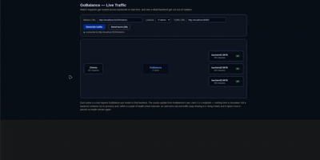
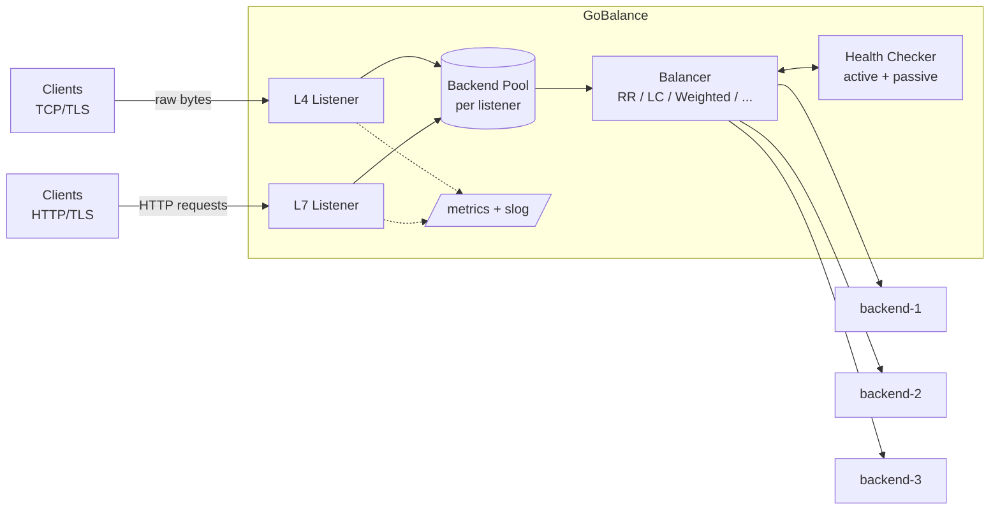

# GoBalance

A Layer 4 (raw TCP) / Layer 7 (HTTP) load balancer written in Go from scratch — no reverse-proxy
framework, no off-the-shelf load balancer wrapped in Go. It's built around three small,
interchangeable abstractions (a concurrency-safe backend pool, a `Balancer` strategy interface with
six algorithms, and a hysteresis-based health checker) that both listener types share, so adding a
TLS toggle, a hot-reloadable config, or a new algorithm never means touching the proxy loop itself.
The point of the project is to demonstrate systems-level engineering — concurrency correctness under
`-race`, graceful failure handling, observability — rather than to compete with nginx/HAProxy/Envoy on
features or performance; see [`docs/PRD.md`](docs/PRD.md) for the explicit non-goals.



*Live traffic distributed round-robin across three backends, then rerouted within a couple of
health-check intervals after one is killed — captured from the browser-based visualizer in
[`deploy/demo-ui`](deploy/demo-ui), which polls GoBalance's own `/metrics` endpoint in real time.*



Full design rationale lives in [`docs/`](docs/):

- [`docs/PRD.md`](docs/PRD.md) — goals, non-goals, functional/non-functional requirements, milestones.
- [`docs/TECH_STACK.md`](docs/TECH_STACK.md) — architecture, project layout, library choices.
- [`docs/THEORY.md`](docs/THEORY.md) — the networking/concurrency theory behind each design decision.
- [`docs/TUTORIAL.md`](docs/TUTORIAL.md) — the phased build guide this project follows, with a
  per-phase progress table at the top.

## Status

Currently implemented:

- **L4 TCP proxy** ([`internal/proxy/l4.go`](internal/proxy/l4.go)) — accepts raw TCP connections,
  one goroutine per connection, relays bytes bidirectionally to a backend chosen by the listener's
  balancer. Optionally TLS-terminating (`*tls.Config` in, `nil` for plaintext).
- **L7 HTTP proxy** ([`internal/proxy/l7.go`](internal/proxy/l7.go)) — built on
  `httputil.ReverseProxy` with a custom `Rewrite` for backend selection; TLS termination is free
  here since `http.Server` decrypts below the handler layer.
- **Backend pool** ([`internal/pool`](internal/pool)) — backend addresses/weights plus
  concurrency-safe health state and an atomic active-connection counter per backend.
- **Six load-balancing algorithms** ([`internal/balancer`](internal/balancer)) — round robin,
  weighted round robin, least connections, weighted least connections, random, and
  power-of-two-choices, all interchangeable behind one `Balancer` interface. `balancer.New(name,
  pool)` constructs any of them from a config string.
- **Active health checking** ([`internal/healthcheck`](internal/healthcheck)) — TCP dial checks for
  L4 pools, HTTP GET + expected-status checks for L7 pools, both with hysteresis (N consecutive
  failures to mark unhealthy, M consecutive successes to recover).
- **TLS termination** — self-signed dev cert support, toggled at runtime with `-tls` rather than
  being TLS-only.
- **YAML configuration** ([`internal/config`](internal/config)) — `configs/example.yaml` defines any
  number of listeners, each with its own type (`l4`/`l7`), algorithm, backends, and health-check
  settings; `main.go` builds a pool/balancer/health-checker per listener from it and runs each on
  its own goroutine.
- **Hot reload** ([`internal/config/store.go`](internal/config/store.go)) — `SIGHUP` (`kill -HUP
  <pid>`) or saving the config file re-reads and re-validates it; a bad edit is logged and the old
  config keeps serving. Backend list and weight changes apply live without dropping in-flight
  connections (surviving backends keep their health state). Changing a listener's algorithm or type,
  or adding/removing listeners, still needs a restart — those are logged and ignored on reload.
- **Structured logging + metrics** ([`internal/logging`](internal/logging),
  [`internal/metrics`](internal/metrics)) — `slog`-based request/reload/health-transition logging;
  Prometheus counters/histograms (`gobalance_requests_total`, `gobalance_request_duration_seconds`,
  `gobalance_reloads_total`) plus live per-backend gauges served on `:9100/metrics`.
- **Graceful shutdown** ([`internal/proxy/l4.go`](internal/proxy/l4.go)) — `SIGTERM`/`SIGINT` stops
  new connections and drains in-flight ones (bounded by `-shutdown-timeout`, default 30s) across all
  listeners concurrently before exiting.
- **Docker Compose demo** ([`deploy/`](deploy/)) — `deploy/Dockerfile` builds a static binary onto
  `distroless/static`; `deploy/docker-compose.yaml` runs it alongside three `hashicorp/http-echo`
  backends using [`configs/docker.yaml`](configs/docker.yaml) (same shape as `example.yaml`, addresses
  swapped to compose service names).

All phases through Phase 10 are done. See [`docs/TUTORIAL.md`](docs/TUTORIAL.md)'s progress table for
exact phase-by-phase status; Phase 11 (portfolio polish) is what's left.

## Running it

The fastest path is the Docker Compose demo:

```bash
docker compose -f deploy/docker-compose.yaml up --build
```

This builds gobalance and starts it alongside three dummy backends, no local Go toolchain or
manual backend setup needed. Once it's up:

```bash
for i in 1 2 3; do curl -s localhost:8080; done
```

cycles across the three backends, and `docker kill deploy-backend1-1` (or whatever `docker compose
ps` names it) shows failover live in `docker compose logs -f gobalance`.

To run it directly instead — useful for iterating on the code — requires Go 1.21+.

`-tls` defaults to `true`, so generate a self-signed dev certificate first (skip this if you plan to
run with `-tls=false`):

```bash
mkdir -p certs
openssl req -x509 -newkey rsa:2048 -nodes -keyout certs/key.pem -out certs/cert.pem -days 365 -subj "/CN=localhost"
```

To try it locally, start three dummy backends first. Giving each one distinct content makes
round-robin cycling visible directly in `curl`'s output, rather than needing to check each backend's
request log. Each backend also needs a `/healthz` file — the default config's L7 listener actively
health-checks that path and expects a `200`, and `python3 -m http.server` 404s on anything that
doesn't exist on disk:

```bash
mkdir -p /tmp/backend1 /tmp/backend2 /tmp/backend3
echo "Hello from backend 9101" > /tmp/backend1/index.html
echo "Hello from backend 9102" > /tmp/backend2/index.html
echo "Hello from backend 9103" > /tmp/backend3/index.html
echo ok > /tmp/backend1/healthz
echo ok > /tmp/backend2/healthz
echo ok > /tmp/backend3/healthz

python3 -m http.server 9101 --bind 127.0.0.1 --directory /tmp/backend1 &
python3 -m http.server 9102 --bind 127.0.0.1 --directory /tmp/backend2 &
python3 -m http.server 9103 --bind 127.0.0.1 --directory /tmp/backend3 &
```

Then, in another terminal:

```bash
go run ./cmd/gobalance
```

This reads [`configs/example.yaml`](configs/example.yaml) by default (override with `-config
path/to/file.yaml`) and starts an L4 listener on `localhost:9090` and an L7 listener on `:9091`,
both round-robining across the three backends above. Health checks run on a 1s interval and need 2
consecutive successes before a backend is used — allow ~3s after starting backends before traffic
stops getting `503 no healthy backends available`.

Send it traffic (TLS is on by default, hence `-k` to skip self-signed-cert verification; add
`-tls=false` to the `go run` command above and use plain `http://`/`nc` instead if you'd rather test
without TLS):

```bash
for i in 1 2 3 4 5 6; do curl -sk https://localhost:9091/index.html; done
```

Each response cycles through the three backends in order, e.g.:

```
Hello from backend 9101
Hello from backend 9102
Hello from backend 9103
Hello from backend 9101
Hello from backend 9102
Hello from backend 9103
```

The L4 listener proxies raw TCP the same way — `openssl s_client -connect localhost:9090` (or `nc
localhost 9090` with `-tls=false`) will get you a response from whichever backend port it picked,
though there's no HTTP framing to make the round-robin cycling as easy to eyeball as the L7 example
above.

### Reloading config

Edit `configs/example.yaml` (add/remove a backend, change a weight) and either save it — the running
process watches the file — or send `kill -HUP $(pgrep -f gobalance)`. The change applies without
dropping connections. A syntactically or semantically invalid edit is logged and the previous config
keeps serving. Algorithm/type changes and listener add/remove require a restart.

## Testing

```bash
go test ./...
go test -race ./...
```

`-race` is treated as a hard requirement, not a nice-to-have — the pool's health state and
active-connection counts are read and written concurrently by the proxy loop and the health checker,
and that's exactly the kind of thing the race detector exists to catch.

## Load testing

`scripts/loadtest.sh` runs three scenarios against a `-race` build of gobalance, via
[`vegeta`](https://github.com/tsenart/vegeta) (`go install github.com/tsenart/vegeta@latest`):

- **Baseline** — steady traffic against healthy backends, nothing else happening. Answers "how fast
  is gobalance": this is the number that maps to the PRD's throughput/latency target.
- **Reload under load** — traffic keeps flowing while `SIGHUP` triggers a live config reload
  mid-attack. Answers "does an in-flight request ever get dropped just because the config changed."
- **Failure injection** — traffic keeps flowing while one backend process is killed outright.
  Answers "how much damage does a real backend crash do before the health checker routes around it."

```bash
scripts/loadtest.sh [rate] [duration]   # defaults: 2000 req/s, 30s
```

Latest results (2,000 req/s, 15s, against `configs/example.yaml`'s 3-backend demo):

| Scenario | Success | p50 | p99 |
|---|---|---|---|
| Baseline | 100.00% | 0.54ms | 1.37ms |
| Reload under load | 100.00% | 0.61ms | 1.54ms |
| Backend killed mid-load | 96.75% (650/20000 failed) | 0.55ms | 1.08ms |

p99 latency stays well under the PRD's 5ms budget, reload drops zero connections, and a killed
backend causes ~2 seconds of partial impact (matching `unhealthy_threshold: 2` × `interval: 1s`,
with round robin routing roughly 1/3 of traffic to the dead backend during that window) before
recovering cleanly.

Two dead ends worth knowing about if you re-run this and see garbage numbers — both are artifacts of
the *dummy backends*, not gobalance:

- Plain `python3 -m http.server` doesn't support HTTP keep-alive, so at load it forces a new TCP
  connection (and ephemeral port) per request; past a few thousand req/s that exhausts the local port
  range and produces multi-second latencies that look like a proxy problem but aren't.
- A naive keep-alive fix re-introduces a different artifact: a flat ~40ms floor on every request,
  the classic Nagle's-algorithm + delayed-ACK interaction (small header/body writes on a
  non-`TCP_NODELAY` socket). `scripts/loadtest.sh`'s dummy backend sets `TCP_NODELAY` explicitly to
  avoid it.
